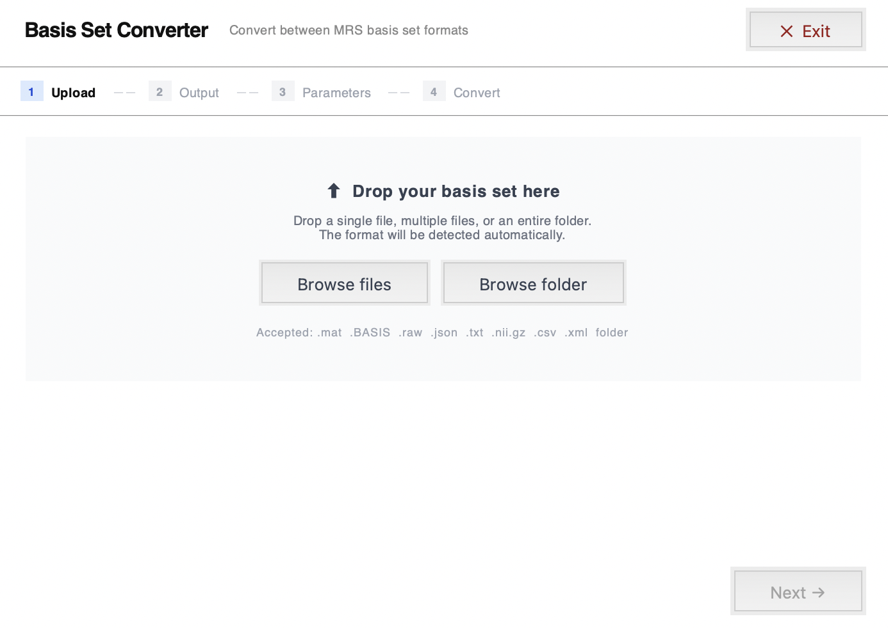
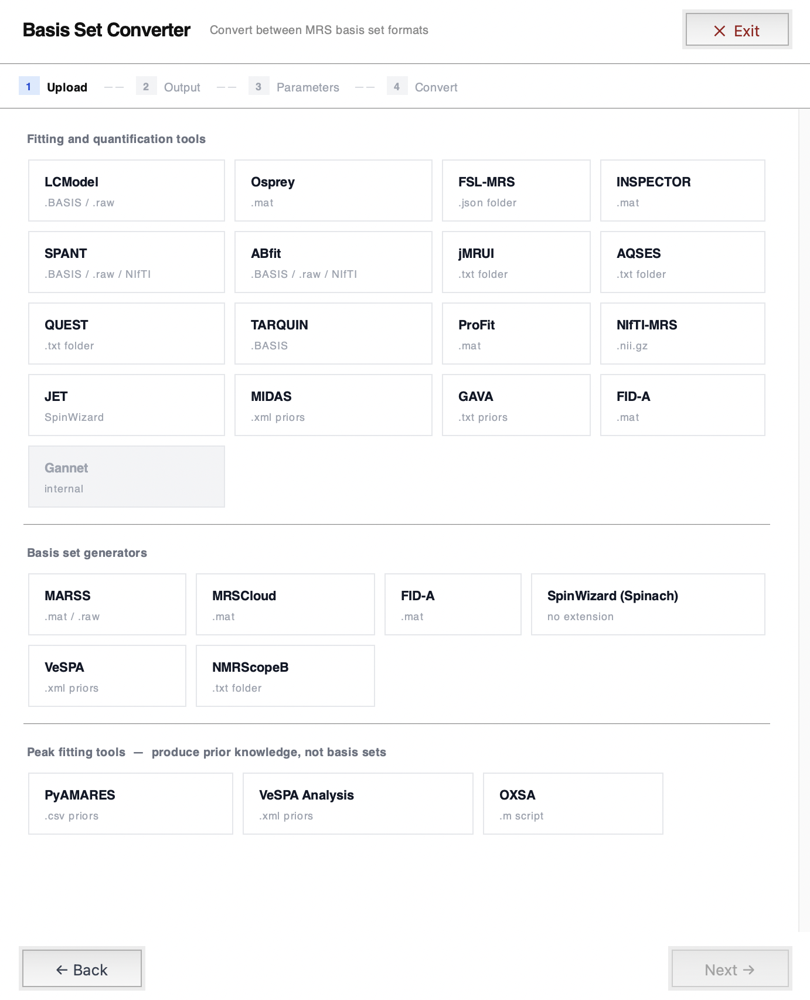

MRS Basis Set Conversion Toolbox version 1.0.0


<h1>Overview</h1>
The MRS Basis Set Conversion Toolbox allows users to convert their basis sets for usage across any fitting tool. This gives the user the flexibility to generate a basis set using any software package and then convert it to a format based on the fitting/ quantifaction software of choice. The user is no longer confined to a fitting/ quantifaction tool based on the format of the basis set. 

<p align="center">
  
  
  
  
  
</p>

<h1>Installation Requirements</h1>
Prerequisites (Python >= 3.9, tkinter), mat73, nibabel, spec2nii. All can be downloaded by running the requirements.txt file using the command below.

```bash
pip install -r requirements.txt
```

<h1>Usage</h1>
Once you have cloned or downloaded the repository, all that is required to launch the gui is typing the following command in terminal.

```bash
python main.py
```

<h1>MATLAB Helper Scripts</h1>
save_spinach_basis.m -> for SpinWizard/Spinach users
save_marss_basis.m —> for MARSS/INSPECTOR visualization


<h1>Sample Basis Sets</h1>
A sample basis set from each tool is included in the "sample_basis_sets" folder. These should all work as I ran them all through the different fitting tools. 

# Supported Formats
 
## Fitting and Quantification Tools
 
| Tool | Format | Notes |
|------|--------|-------|
| LCModel | `.BASIS` / `.raw` | Both formats supported |
| Osprey | `.mat` | MATLAB struct |
| FSL-MRS | `.json folder` | One file per metabolite |
| INSPECTOR | `.mat` | MATLAB struct |
| SPANT | `.BASIS` / `.raw` / NIfTI-MRS | `.BASIS` recommended |
| ABfit | `.BASIS` / `.raw` / NIfTI-MRS | `.BASIS` recommended |
| jMRUI | `.txt folder` | One file per metabolite |
| AQSES | `.txt folder` | Same format as jMRUI |
| QUEST | `.txt folder` | Same format as jMRUI |
| TARQUIN | `.BASIS` | LCModel-compatible |
| ProFit | `.mat` | MATLAB struct |
| NIfTI-MRS | `.nii.gz` | Requires spec2nii and FSL-MRS |
| JET | SpinWizard format | No file extension |
| MIDAS | `.xml priors` | FITT_Generic_XML format |
| GAVA | `.txt priors` | Tab-separated text |
| FID-A | `.mat` | MATLAB struct |
| Gannet | — | Not yet supported |
 
## Basis Set Generators
 
| Tool | Format | Notes |
|------|--------|-------|
| MARSS | `.mat` / `.raw` | Native MARSS format |
| MRSCloud | `.mat` | MATLAB struct |
| FID-A | `.mat` | MATLAB struct |
| SpinWizard (Spinach) | No extension | Two-column ASCII |
| VeSPA | `.xml priors` | VIFF XML format |
| NMRScopeB | `.txt folder` | jMRUI-compatible |
 
## Peak Fitting Tools
 
| Tool | Format | Notes |
|------|--------|-------|
| PyAMARES | `.csv priors` | Peak list CSV |
| VeSPA Analysis | `.xml priors` | VIFF XML format |
| OXSA | `.m script` | Pre-configured MATLAB script |


